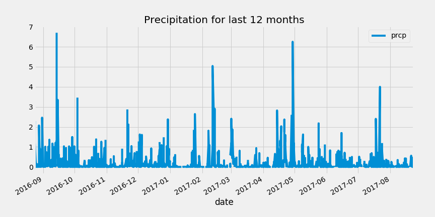
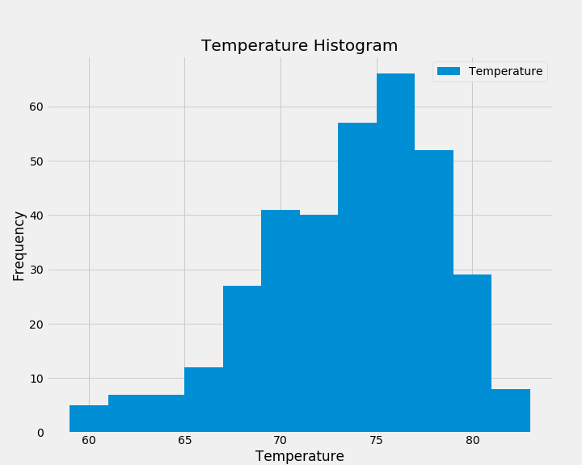
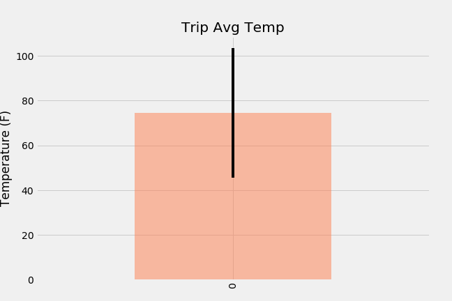
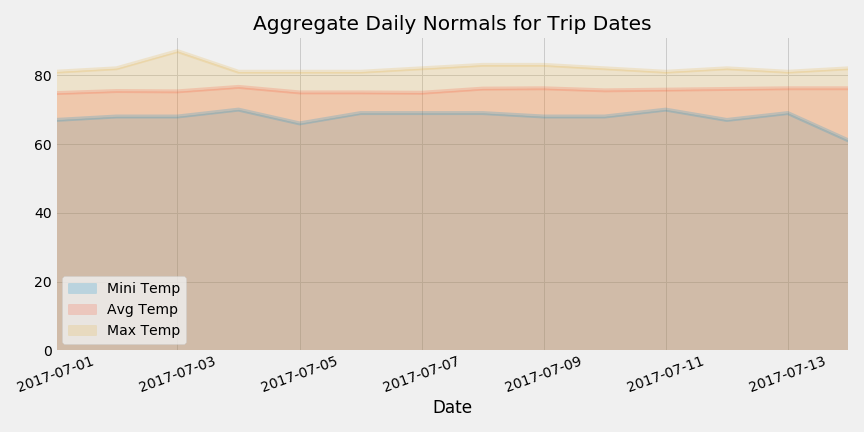

# SQLAlchemy Challange - Surfs Up!

## Climate Analysis and Exploration

Use Python and SQLAlchemy to do basic climate analysis and data exploration of the climate database. Following analysis to be completed using SQLAlchemy ORM queries, Pandas, and Matplotlib.

* Use the provided [hawaii.sqlite](Resources/hawaii.sqlite) files to complete your climate analysis and data exploration.
* Choose a start date and end date for the trip. 
* Vacation range to be approximately 3-15 days total.

### Precipitation Analysis

* Retrieve last 12 months of precipitation data.
* Select only the `date` and `prcp` values.
* Load the query results into a Pandas DataFrame and set the index to the date column.
* Sort the DataFrame values by `date`.
* Plot the results using the DataFrame `plot` method.

  

* Use Pandas to print the summary statistics for the precipitation data.

### Station Analysis

* Calculate total number of stations.
* Find the most active stations.
* List the stations and observation counts in descending order.
* Display station which has the highest number of observations.
* Retrieve last 12 months of temperature observation data (TOBS).
* Filter by the station with the highest number of observations.
* Plot the results as a histogram with `bins=12`.

 

- - -

## Climate Flask App 

Design a Flask API based on the queries that were developed in earlier step. Use Flask to create application routes.

### Routes

* `/`
  * Home page.
  * List all routes that are available.

* `/api/v1.0/precipitation`
  * Query results to a dictionary using `date` as the key and `prcp` as the value.
  * Return the JSON representation of your dictionary.

* `/api/v1.0/stations`
  * Return a JSON list of stations from the dataset.

* `/api/v1.0/tobs`
  * Query the dates and temperature observations of the most active station for the last year of data.
  * Return a JSON list of temperature observations (TOBS) for the previous year.

* `/api/v1.0/<start>` and `/api/v1.0/<start>/<end>`
  * When given the start only, calculate `TMIN`, `TAVG`, and `TMAX` for all dates greater than and equal to the start date.
  * When given the start and the end date, calculate the `TMIN`, `TAVG`, and `TMAX` for dates between the start and end date inclusive.
  * Return a JSON list of the minimum temperature, the average temperature, and the max temperature for a given start or start-end range.

## Note:
* Use Flask `jsonify` to convert your API data into a valid JSON response object.

- - -

## Additional Recommended Analyses

### Temperature Analysis I

* Hawaii is reputed to enjoy mild weather all year. Is there a meaningful difference between the temperature in, for example, June and December?
* Identify the average temperature in June at all stations across all available years and for the month of December temperature in the dataset.
* Use the t-test to determine whether the difference in the means, if any, is statistically significant. Will you use a paired t-test, or an unpaired t-test? Why?

### Temperature Analysis II

* Use the `calc_temps` function to calculate the min, avg, and max temperatures for your trip using the matching dates from the previous year- date in the format `%Y-%m-%d` (i.e., use "2017-01-01" if trip start date was "2018-01-01").

* Plot the min, avg, and max temperature from your previous query as a bar chart.
  * Use the average temperature as the bar height.
  * Use the peak-to-peak (TMAX-TMIN) value as the y error bar (YERR).

 

### Daily Rainfall Average

* Calculate the rainfall per weather station using the previous year's matching dates.
* Calculate the daily normals. Normals are the averages for the min, avg, and max temperatures.
* Function `daily_normals` calculates daily normals for a specific date. This date string will be in the format `%m-%d`.  
* Create a list of dates for your trip in the format `%m-%d`. Use the `daily_normals` function to calculate the normals for each date string and append the results to a list.
* Load the list of daily normals into a Pandas DataFrame and set the index equal to the date.
* Use Pandas to plot an area plot (`stacked=False`) for the daily normals.

  

#### Copyright

Trilogy Education Services © 2019. All Rights Reserved.
